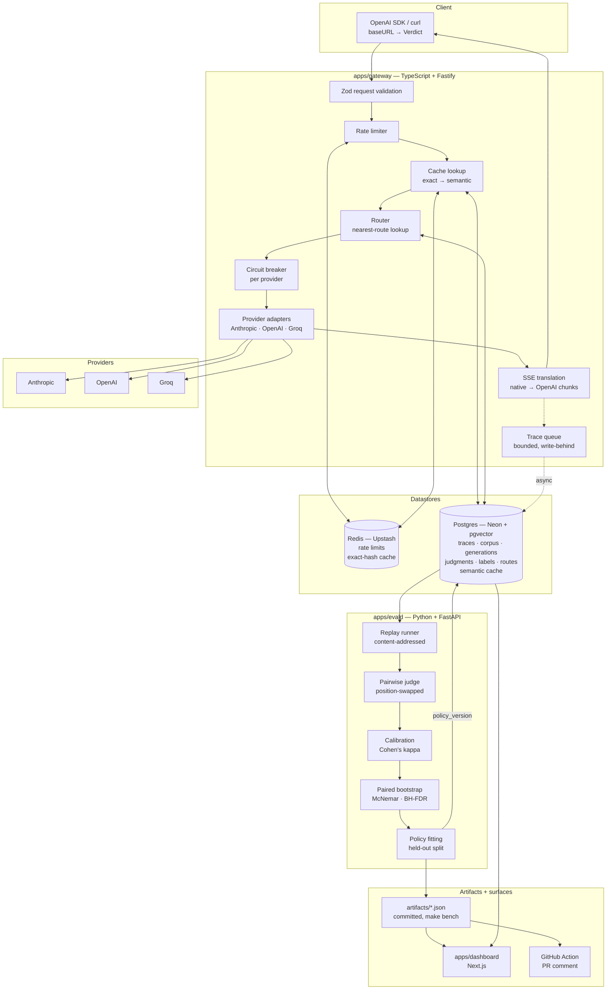
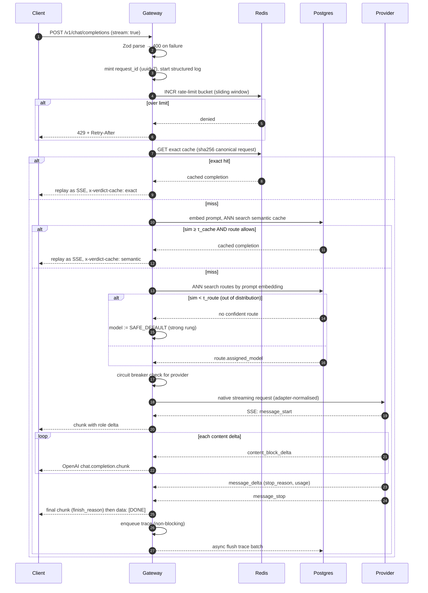

# Verdict — Design Document

**Status:** Phase 0 (design only, no application code)
**Author:** Iraa Garg
**Last updated:** 2026-09-13

---

## 1. Thesis

> Existing LLM evaluation tools measure quality but stop at the report. Verdict closes the
> loop: it turns a measured quality distribution into an enforced routing policy that serves
> the cheapest model whose quality floor holds under a statistical test on held-out data.

The load-bearing word is **held-out**. Anyone can route to a cheap model and claim it is "just as
good." Verdict only demotes a route when the _lower bound_ of a bootstrap confidence interval on
that route's quality clears a floor, on data the policy was not fitted on.

---

## 2. Problem statement

A team ships a product feature backed by an LLM. Three forces pull against each other:

1. **Cost** scales linearly with traffic and is dominated by model choice.
2. **Quality** is not measurable by exact match — outputs are open-ended text.
3. **Confidence** is scarce — a 4-point win rate difference on 50 examples is noise, and teams
   routinely ship on exactly that evidence.

The result, observed repeatedly in public engineering writeups, is one of two failure modes:
a team over-provisions (everything on the frontier model, because nobody can prove a cheaper one
is safe), or it under-provisions (someone swaps in a cheap model on vibes and quality silently
degrades until a customer complains).

### 2.1 Target user

The engineer who owns an LLM-backed feature and its bill. Not an ML researcher. They already have
traffic, they already have a budget conversation coming, and they do not have a statistician.

### 2.2 Why existing tools don't close this loop

| Tool                               | What it does well                                            | Where the loop stays open                                                                                                                            |
| ---------------------------------- | ------------------------------------------------------------ | ---------------------------------------------------------------------------------------------------------------------------------------------------- |
| **LangSmith**                      | Tracing, datasets, online eval, annotation queues            | Produces dashboards and scores. Routing is left entirely to the application; no policy artifact, no statistical gate on model substitution.          |
| **Braintrust**                     | Eval-as-CI, scorers, playground, diffing between experiments | Compares experiments and shows deltas. Significance is presented as descriptive statistics; nothing consumes the result to change serving behaviour. |
| **Promptfoo**                      | Declarative eval matrices, CI assertions, red-teaming        | Config-driven pass/fail assertions. No calibration of the judge against human labels, no per-route policy fitting, no serving component at all.      |
| **OpenRouter / LiteLLM / Portkey** | Multi-provider routing, fallbacks, cost tracking             | Routing is configured by a human or by latency/price heuristics. Quality is never measured, so "cheapest model" is asserted, not proven.             |

The gap is specific and narrow: **nobody joins the measurement artifact to the routing decision
with a significance test.** One half of the market measures without serving; the other half serves
without measuring. Verdict is the join.

I should be honest in interviews that each of these tools _could_ add this. The claim is not that
it is hard to imagine — it is that the end-to-end artifact (calibrated judge → CI → policy → live
router → measured savings) does not exist off the shelf, and building it correctly requires making
a dozen decisions that this document records.

---

## 3. Non-goals

Deliberately out of scope. Each of these is a place where an interviewer could ask "why not?" and
the answer is written down.

- **Not a training or fine-tuning platform.** Verdict changes _which_ model serves a request, never
  the model's weights.
- **Not a general observability backend.** No OTel span ingestion, no non-LLM traces, no APM. If a
  team wants that, they keep their existing tool; Verdict emits a request id they can join on.
- **Not a prompt IDE or playground.** Prompts live in the user's repo; Verdict evaluates them in CI.
- **No multi-tenant authorization, RBAC, or billing.** Single-tenant, one API key namespace.
  Adding tenancy is a schema change (`tenant_id` on every table) and a middleware, not a redesign.
- **No RAG framework, no agent framework, no vector store product.** pgvector is an implementation
  detail of routing and caching, not a user-facing feature.
- **v1 evaluates single-turn completions only.** Multi-turn agentic trajectories with tool use are
  a genuinely harder evaluation problem (credit assignment across steps) and are out of scope.
- **No compliance posture.** No PII redaction, no data residency controls, no SOC2 claims. Section
  10 marks where redaction would go.
- **Verdict does not guarantee the quality of any individual response.** This is the most important
  non-goal. The guarantee is _distributional over a route_: "on traffic resembling this route, the
  cheap model's win-or-tie rate against the reference is at least F, with 95% confidence." A single
  bad response is fully consistent with that guarantee holding. Any claim stronger than this is a
  lie and I will not make it.

---

## 4. Architecture



**Why this split.** The gateway is ~99% network wait, so Node's event loop is the right concurrency
model and Fastify is the fastest mainstream option with first-class schema validation. `evald` is
~99% numeric work over arrays, so it belongs where scipy and numpy live. I am not reimplementing
BCa bootstrap resampling in TypeScript, and I am not putting a latency-sensitive SSE proxy in
Python. The boundary between them is Postgres plus committed JSON artifacts — no RPC, no shared
runtime, no deploy coupling.

### 4.1 Request lifecycle



**Two properties this diagram encodes deliberately.**

_Trace recording is off the request path._ Step "enqueue trace" writes to a bounded in-process
queue; a background flusher batches inserts. If Postgres is unreachable the queue fills, we drop
the oldest traces, and increment `verdict_traces_dropped_total`. Serving traffic is never blocked
on the analytics store. The honest framing is: **Verdict prefers losing observability to losing
availability**, and that preference is a decision, not an accident.

_The router fails toward quality, never toward cost._ Every ambiguous path — no confident route,
missing policy, cold start, unknown task shape — resolves to the strong rung. Cost optimisation only
happens where there is positive evidence it is safe.

---

## 5. Data model

Postgres 16 + pgvector. One store for traces, corpus, generations, judgments, labels, policies and
the semantic cache, because every interesting query is a join across at least two of them ("show me
the traces on routes where haiku was demoted last week").

Embedding dimension is written as `vector(D)` below; `D` is fixed in `config/models.yaml` once the
embedding model is chosen in P2 and is a migration-breaking constant thereafter.

### 5.1 Tables

```sql
-- Enumerated types keep invalid states unrepresentable at the storage layer,
-- mirroring the Zod/Pydantic unions at the application boundary.
CREATE TYPE task_type    AS ENUM ('extraction','classification','sql','summarization','support_reply');
CREATE TYPE split_kind   AS ENUM ('calibration','dev','test');
CREATE TYPE verdict_kind AS ENUM ('win','tie','loss');
CREATE TYPE cache_kind   AS ENUM ('none','exact','semantic');

-- ─────────────────────────────────────────────────────────────────────────────
-- Live traffic
-- ─────────────────────────────────────────────────────────────────────────────
CREATE TABLE traces (
  id                uuid PRIMARY KEY,               -- uuidv7: time-ordered, index-friendly
  request_id        text        NOT NULL,           -- propagated to client + logs
  created_at        timestamptz NOT NULL DEFAULT now(),
  route_key         text,                           -- NULL when unrouted (explicit model override)
  policy_version    int,                            -- which fitted policy served this
  model_requested   text        NOT NULL,
  model_served      text        NOT NULL,
  provider          text        NOT NULL,
  streamed          boolean     NOT NULL,
  request_hash      bytea       NOT NULL,           -- sha256 over canonicalised request
  request_body      jsonb       NOT NULL,
  response_body     jsonb,                          -- NULL on error or aborted stream
  status            smallint    NOT NULL,
  error_kind        text,                           -- timeout|breaker_open|provider_5xx|refusal|...
  finish_reason     text,
  cache_hit         cache_kind  NOT NULL DEFAULT 'none',
  input_tokens      int         NOT NULL DEFAULT 0,
  output_tokens     int         NOT NULL DEFAULT 0,
  cache_read_tokens int         NOT NULL DEFAULT 0,
  cache_write_tokens int        NOT NULL DEFAULT 0,
  cost_usd          numeric(14,8) NOT NULL DEFAULT 0,
  latency_ms        int,
  ttft_ms           int                             -- time to first token; NULL when not streamed
);

-- ─────────────────────────────────────────────────────────────────────────────
-- Frozen benchmark corpus
-- ─────────────────────────────────────────────────────────────────────────────
CREATE TABLE corpus_items (
  id            uuid PRIMARY KEY,
  slug          text        NOT NULL,         -- stable human handle, e.g. 'extract-invoice-041'
  task_type     task_type   NOT NULL,
  split         split_kind  NOT NULL,
  verifiable    boolean     NOT NULL,         -- true → ground_truth + verifier are non-NULL
  messages      jsonb       NOT NULL,         -- the frozen request payload
  ground_truth  jsonb,                        -- only for verifiable items
  verifier      text,                         -- name of the deterministic checker function
  embedding     vector(D),                    -- for clustering + route assignment
  source_trace  uuid REFERENCES traces(id),   -- provenance when harvested from live traffic
  created_at    timestamptz NOT NULL DEFAULT now(),
  CONSTRAINT verifiable_has_truth
    CHECK (verifiable = false OR (ground_truth IS NOT NULL AND verifier IS NOT NULL))
);

-- ─────────────────────────────────────────────────────────────────────────────
-- Replay
-- ─────────────────────────────────────────────────────────────────────────────
CREATE TABLE runs (
  id          uuid PRIMARY KEY,
  created_at  timestamptz NOT NULL DEFAULT now(),
  git_sha     text        NOT NULL,   -- every artifact traces back to a commit
  seed        bigint      NOT NULL,
  config      jsonb       NOT NULL,   -- full resolved config, not a file path
  status      text        NOT NULL    -- running|complete|failed
);

CREATE TABLE generations (
  id             uuid PRIMARY KEY,
  run_id         uuid NOT NULL REFERENCES runs(id) ON DELETE CASCADE,
  item_id        uuid NOT NULL REFERENCES corpus_items(id),
  model          text NOT NULL,
  params_hash    bytea NOT NULL,      -- sha256 of the normalised, model-specific request params
  replicate_idx  smallint NOT NULL,   -- k-th sample of the same (item, model, params)
  output         jsonb,
  stop_reason    text,
  error_kind     text,
  input_tokens   int NOT NULL DEFAULT 0,
  output_tokens  int NOT NULL DEFAULT 0,
  cost_usd       numeric(14,8) NOT NULL DEFAULT 0,
  latency_ms     int,
  verifier_pass  boolean,             -- non-NULL only for verifiable items
  created_at     timestamptz NOT NULL DEFAULT now()
);

-- Content-addressed cache. Outlives runs so `make bench` re-runs cost ~$0.
CREATE TABLE generation_cache (
  cache_key   bytea PRIMARY KEY,      -- sha256(model ‖ params_hash ‖ messages ‖ replicate_idx)
  response    jsonb  NOT NULL,
  usage       jsonb  NOT NULL,
  model       text   NOT NULL,
  created_at  timestamptz NOT NULL DEFAULT now()
);

-- ─────────────────────────────────────────────────────────────────────────────
-- Judging + calibration
-- ─────────────────────────────────────────────────────────────────────────────
CREATE TABLE judgments (
  id             uuid PRIMARY KEY,
  run_id         uuid NOT NULL REFERENCES runs(id) ON DELETE CASCADE,
  item_id        uuid NOT NULL REFERENCES corpus_items(id),
  candidate_id   uuid NOT NULL REFERENCES generations(id),
  reference_id   uuid NOT NULL REFERENCES generations(id),
  judge_model    text NOT NULL,
  rubric_version text NOT NULL,        -- bump invalidates calibration; enforced in code
  position       char(2) NOT NULL,     -- 'ab' | 'ba' — debiasing requires both
  replicate_idx  smallint NOT NULL,
  verdict        verdict_kind NOT NULL,
  raw            jsonb NOT NULL,       -- full structured judge output incl. reasoning
  cost_usd       numeric(14,8) NOT NULL DEFAULT 0,
  created_at     timestamptz NOT NULL DEFAULT now()
);

CREATE TABLE human_labels (
  id            uuid PRIMARY KEY,
  item_id       uuid NOT NULL REFERENCES corpus_items(id),
  candidate_id  uuid NOT NULL REFERENCES generations(id),
  reference_id  uuid NOT NULL REFERENCES generations(id),
  labeler       text NOT NULL,          -- 'iraa' — multiple labelers would enable inter-rater kappa
  label         verdict_kind NOT NULL,
  presented_as  char(2) NOT NULL,       -- randomised; lets me test MY OWN position bias
  elapsed_ms    int,                    -- suspiciously fast labels are a quality signal
  notes         text,
  labeled_at    timestamptz NOT NULL DEFAULT now()
);

-- ─────────────────────────────────────────────────────────────────────────────
-- Fitted routing policy
-- ─────────────────────────────────────────────────────────────────────────────
CREATE TABLE routes (
  id              uuid PRIMARY KEY,
  policy_version  int  NOT NULL,
  route_key       text NOT NULL,
  centroid        vector(D) NOT NULL,
  task_type       task_type,
  assigned_model  text NOT NULL,
  floor_value     real NOT NULL,        -- the quality floor F this route had to clear
  observed_value  real NOT NULL,        -- point estimate of win-or-tie rate on held-out test
  ci_low          real NOT NULL,        -- the number the decision was actually made on
  ci_high         real NOT NULL,
  n_items         int  NOT NULL,
  q_value         real,                 -- BH-adjusted; NULL when no test was needed
  fitted_at       timestamptz NOT NULL DEFAULT now(),
  git_sha         text NOT NULL
);

-- ─────────────────────────────────────────────────────────────────────────────
-- Semantic cache
-- ─────────────────────────────────────────────────────────────────────────────
CREATE TABLE semantic_cache_entries (
  id            uuid PRIMARY KEY,
  embedding     vector(D) NOT NULL,
  request_hash  bytea NOT NULL,
  model         text  NOT NULL,
  route_key     text,
  response      jsonb NOT NULL,
  hits          int   NOT NULL DEFAULT 0,
  created_at    timestamptz NOT NULL DEFAULT now(),
  last_hit_at   timestamptz
);
```

### 5.2 Indexes, and why each one exists

Every index below is justified by a named query. An index with no query behind it is write
amplification I have to pay for on every insert, so it does not get created.

| Index                                                                                                                | Query it serves                                                           | Why this shape                                                                                                                                                                                |
| -------------------------------------------------------------------------------------------------------------------- | ------------------------------------------------------------------------- | --------------------------------------------------------------------------------------------------------------------------------------------------------------------------------------------- |
| `traces_created_at_idx` on `(created_at DESC)`                                                                       | Trace explorer default view; "last N requests"                            | Dashboard's landing query. `DESC` matches the scan direction so no backward scan or sort node.                                                                                                |
| `traces_route_time_idx` on `(route_key, created_at DESC)`                                                            | Per-route spend and volume rollups over a time window                     | Leading equality on `route_key` then range on time — the standard composite ordering. Serves the Pareto chart's per-route aggregation.                                                        |
| `traces_request_id_idx` on `(request_id)`                                                                            | "Here is a request id from a log line, show me the trace"                 | The single most-used debugging path. Non-unique on purpose: an internal retry reuses the id, and I would rather store both attempts than lose one to a constraint violation.                  |
| `traces_hash_idx` on `(request_hash)`                                                                                | Corpus harvesting: find duplicate/near-duplicate live requests            | Deduplication when building the corpus from real traffic.                                                                                                                                     |
| `traces_errors_idx` on `(created_at DESC) WHERE status >= 400`                                                       | Error explorer; incident triage                                           | **Partial.** Errors should be a small fraction of rows; indexing only them keeps the index tiny and the error view fast without paying on every successful insert.                            |
| `traces_body_gin` GIN on `request_body jsonb_path_ops`                                                               | Trace search by payload contents (model, user field, substring of prompt) | `jsonb_path_ops` is smaller and faster than the default GIN opclass for pure containment (`@>`), which is the only operator the explorer needs.                                               |
| `corpus_slug_uniq` UNIQUE on `(slug)`                                                                                | Referencing items by stable handle in artifacts and tests                 | Makes the corpus addressable from committed JSON without leaking UUIDs into git.                                                                                                              |
| `corpus_split_task_idx` on `(split, task_type)`                                                                      | "All test-split extraction items" — the inner loop of every fitting job   | Both columns are low-cardinality equality filters; composite avoids a bitmap AND of two scans.                                                                                                |
| `generations_dedupe_uniq` UNIQUE on `(run_id, item_id, model, params_hash, replicate_idx)`                           | Idempotent replay                                                         | **This is a correctness constraint, not a performance index.** It makes a crashed-and-resumed replay run provably non-duplicating, which is what makes the cost numbers trustworthy.          |
| `generations_item_model_idx` on `(item_id, model)`                                                                   | Cross-run comparison; pairing candidate to reference                      | The paired bootstrap needs matched pairs per item; this is the lookup that builds them.                                                                                                       |
| `judgments_pair_uniq` UNIQUE on `(candidate_id, reference_id, judge_model, rubric_version, position, replicate_idx)` | Idempotent judging; prevents double-counting                              | Double-counted judgments would silently narrow confidence intervals — the exact failure that makes a result look significant when it is not. Enforced in the schema, not in application code. |
| `judgments_item_idx` on `(item_id, verdict)`                                                                         | Per-item aggregation; disagreement mining                                 | Feeds both the stats layer and the "where does the judge disagree with me" review queue.                                                                                                      |
| `labels_pair_labeler_uniq` UNIQUE on `(candidate_id, labeler)`                                                       | One human label per pair per labeler                                      | Prevents me from accidentally labelling the same pair twice and inflating agreement.                                                                                                          |
| `routes_version_key_uniq` UNIQUE on `(policy_version, route_key)`                                                    | Policy lookup; atomic policy activation                                   | A policy version is an immutable set of routes. Serving reads one version; fitting writes the next; activation flips a pointer. No partially-applied policy is ever visible.                  |
| `routes_centroid_hnsw` HNSW on `(centroid vector_cosine_ops)`                                                        | **Hot path.** Nearest-route lookup on every unrouted request              | Routing latency is added to every request, so this index directly determines whether the gateway's overhead budget holds.                                                                     |
| `semcache_embedding_hnsw` HNSW on `(embedding vector_cosine_ops)`                                                    | **Hot path.** Semantic cache probe                                        | Same argument.                                                                                                                                                                                |
| `semcache_created_idx` on `(created_at)`                                                                             | TTL eviction sweep                                                        | Cache entries must expire; without this the sweeper table-scans.                                                                                                                              |

**HNSW over IVFFlat for both vector indexes.** IVFFlat needs a populated table to build meaningful
centroids and degrades when the data distribution shifts after build — exactly what happens as a
cache fills. HNSW has higher build cost and memory, but at our scale (tens of thousands of rows, not
tens of millions) that is irrelevant, and it gives better recall at a given latency without a
rebuild schedule. Recorded in DECISIONS.md.

---

## 6. API contract

Verdict is a drop-in for the OpenAI Chat Completions API. The test of success is that a user
changes `baseURL` and nothing else.

### 6.1 `POST /v1/chat/completions`

Request fields honoured in v1:

| Field                                  | Type    | Notes                                                                                  |
| -------------------------------------- | ------- | -------------------------------------------------------------------------------------- |
| `model`                                | string  | A ladder rung id, **or** the sentinel `verdict-auto` to delegate to the router.        |
| `messages`                             | array   | `system` / `user` / `assistant` roles, string or content-part arrays.                  |
| `stream`                               | boolean | Default `false`.                                                                       |
| `stream_options.include_usage`         | boolean | When true, emit a final usage-only chunk (OpenAI semantics).                           |
| `max_tokens` / `max_completion_tokens` | int     | Mapped to the provider's output cap.                                                   |
| `temperature`, `top_p`                 | number  | **Accepted then dropped, with a warning header, for rungs that reject them.** See 6.4. |
| `response_format`                      | object  | `json_object` / `json_schema` mapped to each provider's structured-output mechanism.   |
| `user`                                 | string  | Recorded on the trace for per-user attribution.                                        |

Rejected with `400` and an OpenAI-shaped error body: unknown fields (Zod `.strict()`), `n > 1`,
`logprobs`, `tools`/`function_call` (v1 is single-turn, non-agentic — see non-goals).

Non-streaming response is the standard `chat.completion` object. Verdict adds response headers
rather than polluting the body, so strict OpenAI clients keep parsing:

```
x-verdict-request-id: 01927f3e-...      # same id in every log line
x-verdict-model-served: claude-haiku-4-5
x-verdict-route: extraction/invoice-a
x-verdict-policy-version: 7
x-verdict-cache: none | exact | semantic
x-verdict-cost-usd: 0.00041200
x-verdict-dropped-params: temperature,top_p   # present only when 6.4 applies
```

### 6.2 SSE contract

Verdict emits OpenAI `chat.completion.chunk` frames. The first chunk carries the role, subsequent
chunks carry content deltas, the penultimate carries `finish_reason`, and the stream terminates with
the literal `data: [DONE]`.

```
data: {"id":"chatcmpl-...","object":"chat.completion.chunk","created":1757800000,"model":"claude-haiku-4-5","choices":[{"index":0,"delta":{"role":"assistant","content":""},"finish_reason":null}]}

data: {"id":"chatcmpl-...","object":"chat.completion.chunk","created":1757800000,"model":"claude-haiku-4-5","choices":[{"index":0,"delta":{"content":"Hello"},"finish_reason":null}]}

data: {"id":"chatcmpl-...","object":"chat.completion.chunk","created":1757800000,"model":"claude-haiku-4-5","choices":[{"index":0,"delta":{},"finish_reason":"stop"}]}

data: [DONE]
```

### 6.3 Anthropic → OpenAI stream translation

The Anthropic Messages API emits a different event stream, so the adapter is a state machine, not a
field rename. Verified event shapes:

| Anthropic event       | Carries                                              | Gateway action                                                                                                                                                                        |
| --------------------- | ---------------------------------------------------- | ------------------------------------------------------------------------------------------------------------------------------------------------------------------------------------- |
| `message_start`       | message id, model, input token usage                 | Emit the role-delta chunk. Record `input_tokens`. Start the TTFT clock stop.                                                                                                          |
| `content_block_start` | block type (`text` / `thinking` / `tool_use`)        | Open block state. **`thinking` blocks are never forwarded to the client** — they are recorded on the trace and dropped from the OpenAI stream, because no OpenAI client expects them. |
| `content_block_delta` | `text_delta` / `thinking_delta` / `input_json_delta` | `text_delta` → content chunk. `thinking_delta` → trace buffer only.                                                                                                                   |
| `content_block_stop`  | —                                                    | Close block state.                                                                                                                                                                    |
| `message_delta`       | `stop_reason`, cumulative `output_tokens`            | Map stop reason; record final usage. This is where the cost number comes from.                                                                                                        |
| `message_stop`        | —                                                    | Emit `finish_reason` chunk, then `data: [DONE]`. Enqueue trace.                                                                                                                       |

Stop-reason mapping: `end_turn`→`stop`, `max_tokens`→`length`, `stop_sequence`→`stop`,
`refusal`→`content_filter`, `tool_use`→`tool_calls` (unreachable in v1).

`refusal` deserves a note: Anthropic returns HTTP 200 with `stop_reason: "refusal"` and a
`stop_details` object. It is **not** an exception and code that only checks HTTP status will treat a
refusal as a successful empty response. Verdict checks `stop_reason` before reading content, records
`error_kind = 'refusal'`, and — critically — **excludes refusals from quality statistics rather than
scoring them as losses**, because a refusal is a policy outcome, not a quality outcome. Counting
them as losses would let a more conservative model look worse on quality when it is actually
behaving correctly.

### 6.4 The parameter-compatibility problem

This is the sharpest edge in the whole gateway and it deserves its own section.

`temperature`, `top_p` and `top_k` **return HTTP 400 on Claude Opus 5 and Claude Sonnet 5.** They
are accepted on Claude Haiku 4.5 and on OpenAI/Groq models. So the ladder is not parameter-uniform:
a request that is valid for the cheap rung is invalid for the mid and strong rungs.

Since Verdict's entire premise is substituting one rung for another underneath an unchanged client
request, this is a correctness issue, not a papercut. Three options were considered; the chosen
behaviour is:

- Each model in `config/models.yaml` declares a capability set (`supports_sampling_params`,
  `thinking_mode`, `supports_effort`, `max_output_tokens`).
- The adapter **drops** unsupported sampling params, serves the request, and reports the drop in
  `x-verdict-dropped-params` and on the trace.
- Dropping is surfaced loudly rather than silently, because a user who set `temperature: 0` expecting
  determinism must learn that they did not get it.
- Requests that explicitly pin a rung and explicitly set a param that rung rejects get a `400` with
  a message naming the incompatibility — no silent drop when the user chose the model themselves.

The same table drives thinking configuration, which is also non-uniform: Opus 5 and Sonnet 5 take
`thinking: {type:"adaptive"}` and reject `budget_tokens` with a 400; Haiku 4.5 still uses
`thinking: {type:"enabled", budget_tokens:N}` and rejects `output_config.effort`. The adapter
normalises; nothing above the adapter knows these differences exist.

---

## 7. Model ladder and cost configuration

### 7.1 Verified pricing

USD per million tokens, fetched from official pricing pages on 2026-09-14. Anthropic cache rates
follow the documented multipliers: a 5-minute cache write is 1.25x base input, a cache read is 0.10x.

| Rung   | Model                 | Provider  | Input | Output | Cache read | Cache write |
| ------ | --------------------- | --------- | ----- | ------ | ---------- | ----------- |
| cheap  | `gpt-5-nano`          | OpenAI    | 0.05  | 0.40   | —          | —           |
| cheap  | `openai/gpt-oss-20b`  | Groq      | 0.075 | 0.30   | —          | —           |
| cheap  | `openai/gpt-oss-120b` | Groq      | 0.15  | 0.60   | —          | —           |
| cheap  | `claude-haiku-4-5`    | Anthropic | 1.00  | 5.00   | 0.10       | 1.25        |
| mid    | `gpt-5`               | OpenAI    | 1.25  | 10.00  | —          | —           |
| mid    | `claude-sonnet-5`     | Anthropic | 2.00  | 10.00  | 0.20       | 2.50        |
| strong | `claude-opus-5`       | Anthropic | 5.00  | 25.00  | 0.50       | 6.25        |

**Correction to the project brief:** the model id `claude-haiku-4-5-20251001` is not valid. Current
Claude model ids carry no date suffix. The config schema now rejects date-suffixed ids at boot.

**Not in the ladder:** Groq's Llama models are published as "Enterprise — contact sales" with no
per-token price. A rung with no published price cannot appear in a cost comparison. OpenAI and Groq
cached-input rates are likewise unverified and stored as `null`, which the cost meter treats as
"unknown" rather than zero — it refuses to record a cost rather than under-count one.

### 7.2 Revising the P0 finding

P0 concluded from the Anthropic-only ladder that the cheap-to-strong spread was **5x** and that
savings would therefore be modest. That was correct within Anthropic and wrong across the full
ladder: `gpt-5-nano` to `claude-opus-5` is a **100x** input spread and a **62x** output spread.

The three consequences still stand, in revised form:

1. **Headline savings now depend almost entirely on how much traffic can drop to a non-Anthropic
   cheap rung.** That is an empirical question P5 answers, not an assumption. Within Anthropic alone
   the ceiling really is 5x, so if quality forces every route onto a Claude rung, P0's pessimistic
   number is the one that holds.
2. **Two non-routing levers still have their own multipliers** and remain competing arms, not
   complements:
   - **Effort.** `output_config.effort` moves token spend within a single model. Anthropic's cost
     guidance is explicit that "the strong model at lower effort" is the experiment to run before
     building a multi-model cascade. If Opus-at-`low` beats Haiku-at-default on the frontier, the
     thesis is weakened and I need to know that.
   - **Batch API at 50%.** All of P2 and P3 is offline and latency-insensitive, so replay and
     judging go through the Batch API. This roughly halves the eval budget.
3. **Prompt caching is model-scoped, so routing forfeits cache reuse.** A cache read costs 0.10x
   base input. A route whose traffic shares a long system prefix gets large savings from staying on
   one model, and splitting it across rungs fragments the cache namespace. Now that the cache rates
   are verified, P5 can measure this properly rather than flag it (Section 11, threat 1).

### 7.3 Config file shape

Pricing is never inline. `config/models.yaml`, validated by one JSON Schema that generates both the
Zod type (gateway) and the Pydantic model (evald), so the two services cannot disagree:

```yaml
embedding:
  model: <chosen in P2>
  dimensions: <D>

models:
  claude-haiku-4-5:
    provider: anthropic
    rung: cheap
    context_window: 200000
    pricing: # USD per million tokens
      input: 1.00
      output: 5.00
      cache_read: null # TBD — fetch from official docs in P1
      cache_write: null
      verified_at: "2026-09-13"
      source: "https://www.anthropic.com/pricing"
    capabilities:
      supports_sampling_params: true
      supports_effort: false
      thinking_mode: budget_tokens
      supports_prefill: true
```

`verified_at` and `source` are required fields. A price with no provenance fails schema validation
and the process refuses to boot — the same discipline non-negotiable #6 applies to secrets, applied
to numbers that end up on a resume.

---

## 8. Routing algorithm

### 8.1 Offline fitting (runs in `evald`, produces a policy version)

```
fit_policy(corpus, ladder, F, alpha, seed):
    # 1. Discover routes on data the decision will NOT be made on.
    embeddings ← embed(item.messages for item in corpus.calibration ∪ corpus.dev)
    k          ← argmax_k silhouette(kmeans(embeddings, k, seed)) for k in K_RANGE
    clusters   ← kmeans(embeddings, k, seed)
    routes     ← [Route(key=name(c), centroid=mean(c), task_type=mode(c.task_types))
                  for c in clusters]

    # 2. Assign held-out test items to routes by nearest centroid.
    for item in corpus.test:
        item.route ← argmin_r cosine_distance(embed(item), r.centroid)

    # 3. For each route, walk the ladder cheapest-first and stop at the first
    #    rung whose LOWER confidence bound clears the floor.
    pending ← []
    for route in routes:
        items ← corpus.test where route = route
        if |items| < N_MIN:                       # too little evidence to demote anything
            route.assigned ← STRONG ; route.reason ← 'insufficient_n' ; continue

        ref ← generations[items, REFERENCE_MODEL]

        for rung in ladder ordered by cost_per_request ascending:
            if rung is REFERENCE_MODEL: break

            cand    ← generations[items, rung]
            outcome ← [judge_consensus(c, r) for (c, r) in zip(cand, ref)]   # win/tie/loss per item
            outcome ← exclude(outcome, where either side errored or refused)

            w̄  ← mean(outcome is win or tie)
            ci ← paired_bootstrap_ci(outcome, B=10000, alpha, seed)
            p  ← mcnemar_exact(outcome)                                       # vs the reference

            pending.append((route, rung, w̄, ci, p))

        # 4. Control the false-discovery rate ACROSS all (route, rung) tests,
        #    because we are running |routes| × |ladder| tests and some will
        #    clear a naive threshold by chance alone.
    q ← benjamini_hochberg([p for (_,_,_,_,p) in pending], alpha)

    for (route, rung, w̄, ci, p), q_i in zip(pending, q):
        if route.assigned already set: continue
        if ci.low ≥ F and q_i ≤ alpha:
            route.assigned ← rung                 # the guarantee: LOWER BOUND clears the floor
            route.record(w̄, ci, q_i)
        # else: fall through to the next-cheapest rung, ultimately STRONG

    for route where no rung qualified:
        route.assigned ← STRONG ; route.reason ← 'no_rung_cleared_floor'

    return PolicyVersion(routes, F, alpha, seed, git_sha)
```

Three properties worth defending in an interview:

- **`ci.low ≥ F`, not `w̄ ≥ F`.** Using the point estimate would demote a route on a coin flip. Using
  the lower bound means small samples produce wide intervals and therefore _refuse to demote_. The
  method is biased toward spending money, which is the correct direction for a safety mechanism.
- **Fitting uses calibration+dev for clustering, test for the decision.** Choosing `k` and the
  centroids on the same data used for the significance test would leak and inflate every result.
- **BH-FDR across all route×rung tests.** With 8 routes × 2 candidate rungs, at α=0.05 we expect
  ~0.8 spurious "significant" results per fit. Without correction the policy would confidently demote
  a route on noise roughly every other run. This is the single most common statistical error in eval
  tooling and correcting it is cheap.

### 8.2 Runtime (gateway hot path)

```
route(request):
    if request.model ≠ 'verdict-auto':
        return (request.model, route_key=null)      # explicit pin always wins

    policy ← cache.get_active_policy()              # in-process, refreshed on version bump
    if policy is null: return (SAFE_DEFAULT, 'no_policy')

    e ← embed_cached(canonical_prompt(request))
    (r, sim) ← nearest_route(e, policy)             # pgvector HNSW, cosine

    if sim < TAU_ROUTE:                             # out of distribution
        return (SAFE_DEFAULT, 'ood')

    if breaker_open(provider_of(r.assigned)):
        return (fallback_rung_at_or_above(r.assigned), 'breaker')

    return (r.assigned, r.key)
```

`TAU_ROUTE` is fitted, not guessed: chosen on the dev split as the similarity below which route
assignment accuracy degrades past a set threshold. The OOD path exists because a fitted policy says
nothing about traffic that does not resemble the corpus, and the honest response to "I have no
evidence about this request" is to spend money on it.

Note the breaker fallback escalates **upward only**. A circuit breaker must never cause a silent
quality downgrade — that would turn an availability incident into an unmeasured quality incident.

---

## 9. Evaluation methodology

### 9.1 Corpus design

Roughly 300 items, frozen, committed, split **calibration 20% / dev 30% / test 50%** — stratified by
task type. The test split is large because it carries the significance tests, and CI width is what
determines whether anything can be demoted at all.

- **~60% verifiable** (`extraction`, `classification`, `sql`): each item has a machine-checkable
  ground truth and a named deterministic verifier. These exist so the judge can be validated against
  _objective truth_, not only against my opinion.
- **~40% open-ended** (`summarization`, `support_reply`) over a fixed document set. These are where a
  judge is actually necessary and where routing decisions are interesting.

Sourcing: generated against a fixed scenario set and replayed through the gateway so that corpus
items are real traces with real provenance (`corpus_items.source_trace`). Every item records where it
came from. Items are never edited after freeze; corrections create a new slug.

The dual composition is what lets P3 report two different and independently meaningful numbers:
**judge-vs-ground-truth accuracy** on the verifiable slice, and **judge-vs-human Cohen's κ** across
the whole corpus.

### 9.2 Judge design

Pairwise against a frozen reference output from the strong rung, emitting `win` / `tie` / `loss`.

- **Position-swapped.** Every pair is judged twice, as `ab` and `ba`. A verdict counts only if both
  orders agree; disagreement collapses to `tie`. This converts position bias from a silent bias into
  a measured quantity — the flip rate is itself a reported metric.
- **Structured output, not parsed prose.** The judge returns a schema-constrained object
  (`output_config.format`) with a verdict field and a reasoning field. No regex over free text.
- **Rubric is versioned** (`rubric_version`). Changing a single word of the rubric invalidates the
  calibration; the fitting job refuses to mix rubric versions.
- **The judge model is disclosed as a threat to validity.** Using `claude-opus-5` as both judge and
  reference/strong rung creates a self-preference risk. Mitigation: a held-out subset is re-judged by
  a different-family judge (an OpenAI model), and the disagreement rate is reported. If self-
  preference is material, the reference and the judge get separated.
- **Ties are first-class.** Forcing a binary win/loss on genuinely equivalent outputs manufactures
  variance. `win-or-tie rate` is the metric the routing floor is expressed in, precisely because it
  is robust to the tie/win boundary.

### 9.3 Calibration protocol

1. Sample ~180 pairs from the **calibration split** only.
2. I label them **blind**: model identities hidden, A/B order randomised per pair, presentation order
   randomised, one pair per screen, labelling time recorded.
3. Compute **Cohen's κ** between my labels and the judge's consensus verdict on 3 classes.
4. Compute the judge's **accuracy against ground truth** on the verifiable subset.
5. Compute the judge's **position-flip rate** and my own position-flip rate on a duplicated subset —
   because if the human gold standard has position bias, κ is measuring the wrong thing.
6. **Gate:** if κ < 0.6 the judge is not fit for purpose. The response is to revise the rubric,
   re-label a fresh calibration sample, and bump `rubric_version` — _not_ to reuse the same labels,
   which would overfit the rubric to the calibration set.

κ will be reported with its 95% CI and its confusion matrix, and the confusion matrix is the
interesting artifact: a judge that agrees on win/loss but disagrees on where "tie" begins is a very
different instrument from one that gets the direction wrong.

### 9.4 Statistical tests

| Question                                                      | Test                                                                 | Why this one                                                                                                                                                                                                                                                                                                       |
| ------------------------------------------------------------- | -------------------------------------------------------------------- | ------------------------------------------------------------------------------------------------------------------------------------------------------------------------------------------------------------------------------------------------------------------------------------------------------------------ |
| Is candidate's win-or-tie rate above floor F?                 | **Paired percentile bootstrap CI**, B=10,000, seeded                 | Same items scored by both models, so the pairing removes item difficulty as a variance source. Bootstrap makes no normality assumption about a bounded, discrete, skewed metric. Percentile rather than BCa: at n≈150 the acceleration correction is marginal and percentile is far easier to defend line-by-line. |
| Did this PR cause a regression?                               | **McNemar's exact test** on discordant pairs                         | The data is paired binary (did each item improve or degrade). McNemar conditions on the discordant pairs, which is exactly the right conditioning for before/after on the same items. Exact rather than χ² because discordant counts will often be small.                                                          |
| Are any of my many "significant" results just noise?          | **Benjamini–Hochberg FDR** at α across all route×rung tests in a fit | Running ~16 tests per fit at α=0.05 produces ~1 false positive per fit. BH controls the expected proportion of false demotions while being less brutal than Bonferroni.                                                                                                                                            |
| Do I even have enough data to detect the effect I care about? | **Power analysis**, reported per route, before the fit               | A non-significant result on 20 items means nothing; reporting power stops me from presenting "no regression detected" as "no regression."                                                                                                                                                                          |

Every test is seeded. `artifacts/stats.json` records B, α, seed, n, the observed statistic, the CI
bounds, the raw p, the BH q, and the achieved power for every single test run.

### 9.5 What "deterministic replay" actually means

The brief specifies deterministic replay. `temperature` is **rejected with a 400 on Opus 5 and
Sonnet 5**, so sample-level determinism is not achievable and any claim of it would be false.

Verdict's determinism is therefore defined at the pipeline level, which is both achievable and more
useful:

- **Content-addressed generation cache.** `sha256(model ‖ params_hash ‖ messages ‖ replicate_idx)`.
  A second `make bench` replays from cache, produces byte-identical artifacts, and costs $0.
- **Seeded everywhere else.** Corpus splits, k-means init, bootstrap resampling, A/B position
  assignment, and label presentation order all derive from one run seed recorded in `runs.seed`.
- **Sampling variance is measured, not wished away.** K replicates per (item, model) estimate
  within-model variance, and that variance is carried into the confidence interval rather than being
  ignored. A model whose outputs vary wildly gets a wider CI and is therefore harder to promote —
  which is the correct incentive.
- **Full provenance.** Every generation stores model id, resolved params, response id, and git SHA.

This is a stronger position than `temperature=0` would have been: it makes the _conclusion_
reproducible while being honest that the _samples_ are not.

---

## 10. Failure modes

Defined behaviour for every failure the system can encounter. "Defined" means there is a test for it.

| #   | Failure                                          | Detection                                                                       | Behaviour                                                                                                                                                                                                         | Client sees                                                                      | Recorded                                                                                          |
| --- | ------------------------------------------------ | ------------------------------------------------------------------------------- | ----------------------------------------------------------------------------------------------------------------------------------------------------------------------------------------------------------------- | -------------------------------------------------------------------------------- | ------------------------------------------------------------------------------------------------- |
| 1   | **Provider 5xx**                                 | HTTP status ≥ 500                                                               | Retry ≤2 with exponential backoff + full jitter; then escalate one rung if the request was auto-routed, else fail                                                                                                 | `502` with OpenAI-shaped error, or a successful response from the escalated rung | `error_kind='provider_5xx'`, retry count                                                          |
| 2   | **Provider timeout**                             | Per-request deadline (connect 5s, TTFT 30s, total 120s — configurable per rung) | Abort the upstream request explicitly; same retry/escalate ladder as #1                                                                                                                                           | `504`                                                                            | `error_kind='timeout'`, which deadline tripped                                                    |
| 3   | **Stream aborts mid-token**                      | Upstream closes before `message_stop`                                           | Flush buffered content, emit a `finish_reason: "length"` chunk then `[DONE]` so the client's parser terminates cleanly. **Never leave a hanging stream.** Partial content is persisted.                           | Truncated but well-formed SSE stream                                             | `error_kind='stream_abort'`, partial output, tokens-so-far                                        |
| 4   | **Client disconnects mid-stream**                | `request.raw` close event                                                       | Abort the upstream call immediately via `AbortController` — do not keep paying for tokens nobody will read                                                                                                        | —                                                                                | `error_kind='client_abort'`, partial cost                                                         |
| 5   | **Provider rate limit (429)**                    | Status 429                                                                      | Honour `Retry-After` when present, else backoff+jitter. Open the breaker after N consecutive 429s. Escalate rung or shed load.                                                                                    | `429` with `Retry-After`                                                         | `error_kind='rate_limited'`                                                                       |
| 6   | **Circuit breaker opens**                        | N consecutive failures in a window, per (provider, model)                       | Stop calling that provider for the cooldown; half-open with a single probe. Auto-routed traffic re-routes **upward only**                                                                                         | Success from another rung, or `503` if none available                            | `error_kind='breaker_open'`, breaker state transitions                                            |
| 7   | **Postgres unreachable**                         | Connection/health check failure                                                 | **Serving continues.** Trace queue fills, oldest dropped, counter incremented. Router falls back to the last in-process policy snapshot; if none, `SAFE_DEFAULT`. Semantic cache is skipped.                      | Normal responses                                                                 | `verdict_traces_dropped_total`, degraded-mode log at WARN                                         |
| 8   | **Redis unreachable**                            | Connection failure / timeout                                                    | **Fail open on rate limiting** (availability over quota enforcement, logged loudly), skip exact cache. Explicitly a deliberate choice: this is a portfolio gateway, not a billing perimeter.                      | Normal responses                                                                 | Degraded-mode log at WARN                                                                         |
| 9   | **Model refuses** (`stop_reason: "refusal"`)     | Checked before reading content — it is HTTP 200, not an exception               | Pass through as `finish_reason: "content_filter"`. **Excluded from quality statistics**, never scored as a loss                                                                                                   | Standard OpenAI content-filter finish                                            | `error_kind='refusal'` + category                                                                 |
| 10  | **Judge disagrees with itself across positions** | `ab` verdict ≠ `ba` verdict                                                     | Collapse to `tie`; increment the flip-rate metric. Flip rate above a threshold **fails the calibration gate** and blocks policy fitting                                                                           | —                                                                                | Both verdicts retained for analysis                                                               |
| 11  | **Judge output fails schema**                    | Structured-output validation                                                    | Retry once; on second failure record `unparseable` and **exclude the item from the statistic** rather than guessing a verdict                                                                                     | —                                                                                | Raw output retained                                                                               |
| 12  | **Cost cap breached**                            | Running spend per (run \| API key \| day) against a configured cap              | Offline: the replay run halts at the boundary and writes a partial, clearly-marked artifact. Online: reject new requests                                                                                          | `429` with a cost-cap error code                                                 | `error_kind='cost_cap'`, spend at breach                                                          |
| 13  | **Semantic cache false hit**                     | Offline: the P6 false-hit measurement                                           | Not detectable at request time by construction — which is why the threshold is _fitted_ and the false-hit rate is _published alongside_ the hit rate. A hit rate without a false-hit rate is a meaningless number | Possibly a wrong answer                                                          | Every semantic hit is traced with its similarity score so false hits are auditable after the fact |
| 14  | **Malformed request**                            | Zod `.strict()` at the boundary                                                 | `400` before any provider call, any spend, or any DB write                                                                                                                                                        | OpenAI-shaped `invalid_request_error`                                            | Rejected-request counter                                                                          |
| 15  | **Missing/malformed env at boot**                | Schema validation in the entrypoint                                             | **Process exits non-zero before binding the port.** Never a request-time failure                                                                                                                                  | —                                                                                | Fatal log naming the offending variable, value redacted                                           |
| 16  | **Policy version mismatch**                      | Serving policy's embedding dimension ≠ configured `D`                           | Refuse to activate the policy; keep serving the previous version                                                                                                                                                  | Normal responses from the old policy                                             | Fatal-on-activation log                                                                           |

Retry policy note: the Anthropic SDK retries twice by default. The gateway sets `maxRetries: 0` on
the SDK client and owns retry, backoff, jitter, and the breaker itself — otherwise two retry policies
compose into an unpredictable one, and the breaker never sees the failures it is supposed to count.
(The TypeScript SDK's `timeout` is in **milliseconds**, unlike the Python SDK's seconds.)

---

## 11. Threats to validity

Written before building, so that the README can address them instead of an interviewer discovering
them.

1. **Prompt caching is model-scoped, so routing fights caching.** Cache reads are dramatically
   cheaper than fresh input tokens. A route with a long shared system prefix may be cheaper served
   entirely by one model with a warm cache than split across rungs with a cold one. _Mitigation:_
   P5 measures a cache-aware cost model, and a route is only demoted if it is cheaper **after**
   accounting for lost cache reuse. If this kills the thesis for prefix-heavy routes, that finding
   goes in the README.
2. **The effort lever may dominate the model lever.** "Strong model at low effort" is a competing
   arm, not a footnote. P5 runs it as a first-class arm on the same Pareto plot.
3. **Judge self-preference.** Opus-as-judge grading Opus-as-reference. Measured via cross-family
   re-judging on a held-out subset (§9.2).
4. **My labels are the gold standard, and I am one person.** κ measures agreement with me, not with
   truth. The verifiable slice partially addresses this; a second labeler would address it properly
   and is out of budget. Stated as a limitation.
5. **A synthetic corpus is not production traffic.** Route discovery on synthetic data may find
   cleaner clusters than reality contains. The OOD guard (`TAU_ROUTE`) is the structural mitigation.
6. **Small n per route.** With ~150 test items over ~8 routes, per-route n is ~19. That may be too
   small to demote anything at all. `N_MIN` and the reported power exist to make this visible rather
   than to paper over it. If the answer is "no route had enough evidence," that is a publishable
   result about the difficulty of the problem, and I will publish it.

---

## 12. Reproducibility contract

- `make bench` runs the full pipeline and writes `artifacts/*.json`. Every number in the README and
  on my resume is read from those files.
- Every artifact embeds: git SHA, run seed, model ids, resolved config, wall-clock, and total USD
  spent.
- A second `make bench` on an unchanged tree replays from the content-addressed cache, produces
  byte-identical artifacts, and costs $0. CI asserts exactly this.
- Artifacts are committed. A number that is not in a committed artifact does not exist.

---

## 13. Open items to resolve before / during P1

Deliberately unresolved, and flagged rather than guessed:

1. **Groq and OpenAI pricing and current model ids** — fetch from official pricing pages before any
   rung is added. Not estimated here.
2. **Anthropic cache-read / cache-write price multipliers** — needed for the cache-aware cost model
   in threat #1.
3. **Embedding model and dimension `D`** — decided in P2; it is a migration-breaking constant, so it
   gets its own decision entry.
4. **`N_MIN`, `TAU_ROUTE`, `TAU_CACHE`, floor `F`** — all fitted on dev data in P5/P6, never
   hand-picked. Their fitting procedures are specified; their values are not asserted here.
