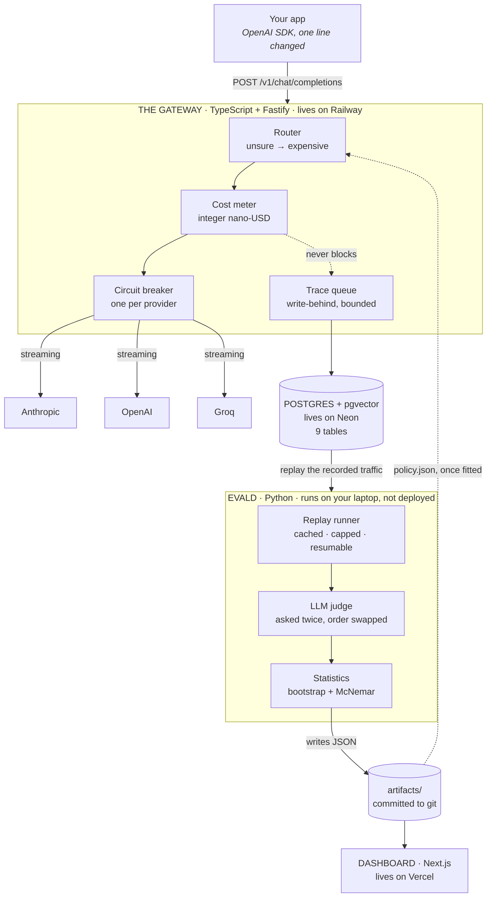

# Verdict, explained from zero

Assumes you know nothing about this project. Read top to bottom.

|           |                                                      |
| --------- | ---------------------------------------------------- |
| Dashboard | **https://verdict-navy.vercel.app**                  |
| Gateway   | **https://verdictgateway-production.up.railway.app** |
| Code      | **https://github.com/iraagarg/verdict**              |

---

# Part 1 — The problem

## Start with money

You are building an app that uses AI. Every question your app asks an AI company costs money.

But there isn't one AI — there are many, at very different prices. Here is the actual list this
project uses, with real prices per **million** words:

| Model                 | Who makes it      | Price in | Price out |
| --------------------- | ----------------- | -------- | --------- |
| `gpt-5-nano`          | OpenAI            | $0.05    | $0.40     |
| `openai/gpt-oss-20b`  | open, run by Groq | $0.075   | $0.30     |
| `openai/gpt-oss-120b` | open, run by Groq | $0.15    | $0.60     |
| `claude-haiku-4-5`    | Anthropic         | $1.00    | $5.00     |
| `gpt-5`               | OpenAI            | $1.25    | $10.00    |
| `claude-sonnet-5`     | Anthropic         | $2.00    | $10.00    |
| `claude-opus-5`       | Anthropic         | $5.00    | $25.00    |

The cheapest and the most expensive differ by **67× on the way in and 83× on the way out.**

If your app handles a million questions a month, that is the difference between a $50 bill and a
$4,000 bill. Same app. Same users.

## So the question is obvious

**Can I use the cheap one?**

## And the answer is genuinely hard

If the AI is doing maths, checking is easy. `17 × 23 = 391`. Right or wrong. Done.

But most AI work is **writing**:

- summarise this support ticket
- explain this policy to a customer
- rewrite this email more politely

There is no correct answer to compare against. Two summaries can both be fine and completely
different. So "is the cheap model good enough?" has no obvious test.

## What people actually do about it

Two things, and both are guesses:

**Guess 1 — "seems fine."** Someone tries the cheap model on fifteen examples, reads them, thinks
_yeah that's fine_, and switches. Quality quietly drops. Nobody notices for months.

**Guess 2 — "don't risk it."** Nobody dares change anything, so the company pays for the expensive
model forever, including for questions a cheap model would have handled perfectly.

**Verdict replaces the guess with a measurement.**

---

# Part 2 — The thinking

This is the part worth understanding, because it is what makes the project more than plumbing.

## Tools already exist for measuring AI quality

LangSmith, Braintrust, Promptfoo. They all help you evaluate AI outputs.

**What none of them do is close the loop.** They tell you a score. They do not then take that score
and change where your traffic goes. A human still reads a dashboard and decides.

That gap is the project:

> Existing tools measure LLM quality but do not close the loop to automatic cost-optimal routing
> with a proven quality guarantee. Verdict does.

## The trap that makes this hard

Suppose you test two models and find no difference between them. That could mean **two opposite
things**:

| What it might mean                                  | What you should do                   |
| --------------------------------------------------- | ------------------------------------ |
| You measured carefully and they really are the same | **Switch.** Save the money.          |
| You didn't test enough to notice a difference       | **Do not switch.** You know nothing. |

Most tools report both as _"no significant difference."_

**That single phrase is how teams ship a change they cannot justify.** They read it as the first
meaning when it was the second.

## So Verdict gives four answers, not three

| Answer           | Means                                                           |
| ---------------- | --------------------------------------------------------------- |
| **REGRESSION**   | The cheap one is genuinely worse. Don't switch.                 |
| **IMPROVEMENT**  | It is genuinely better.                                         |
| **EQUIVALENT**   | Measured precisely, difference is small. **Switch and save.**   |
| **INCONCLUSIVE** | Not measured precisely enough to say. **Go and get more data.** |

Only **EQUIVALENT** lets you spend less. **INCONCLUSIVE** is not a failure — it is the honest
answer most of the time, and saying it out loud is the whole point.

## One more principle: fail expensive

Every system has moments of uncertainty. A config file is missing. A setting has a typo. A kind of
question arrives that nobody tested.

Verdict's rule: **when unsure, use the expensive model.**

Think about the opposite rule. A typo would quietly downgrade your real users to a worse model, and
nobody would find out for weeks.

With this rule, a mistake shows up **on a bill** — annoying, visible, fixable. Not in angry
customer emails.

---

# Part 3 — The solution

Verdict is a **middleman**. It sits between an app and the AI companies.

```
your app  →  VERDICT  →  Anthropic / OpenAI / Groq
```

Your app doesn't know it's there. Same requests, same answers. But Verdict watches everything that
goes through, and can measure whether a cheaper model would have done just as well.

## The seven pieces

| Piece          | Job                                                                          |
| -------------- | ---------------------------------------------------------------------------- |
| **Gateway**    | The middleman. Passes requests through, records every one, handles failures. |
| **Test set**   | 1,500 questions used to compare models.                                      |
| **Runner**     | Asks every model every question. Free to re-run. Cannot overspend.           |
| **Judge**      | An AI referee for questions that have no right answer.                       |
| **Statistics** | Decides whether a difference is real or luck. **The heart.**                 |
| **Router**     | Picks which model to use. Unsure → picks the expensive one.                  |
| **Dashboard**  | A website showing what was measured.                                         |

---

# Part 4 — The architecture



## Read the diagram in one sentence each

1. Your app talks to the **gateway** instead of talking to Anthropic directly.
2. The gateway picks a model, counts the cost, and forwards the request.
3. Every request is written to **Postgres** — but on a background queue, so recording can never slow
   down or break a real request.
4. Later, **evald** takes that recorded traffic and replays it against other models.
5. A **judge** scores the answers, and **statistics** decide whether any difference is real.
6. The result is written to a JSON file in `artifacts/` and committed to git.
7. The **dashboard** reads those files. **It has no database and no passwords** — it only reads
   committed files, so it cannot break during a demo.
8. Eventually that result becomes a routing policy the gateway reads.

**That last arrow is the "closed loop."** The measurement becomes the routing decision. That is the
part other tools don't do.

---

# Part 5 — The tech stack

Every choice with the reason, because "why did you pick that?" is an interview question.

## The gateway — TypeScript

| Thing                       | Version | Why                                                                   |
| --------------------------- | ------- | --------------------------------------------------------------------- |
| **TypeScript**              | 5.7     | Strict mode, no `any` allowed. Errors caught before running.          |
| **Fastify**                 | 5.2     | Web server. Faster than Express and has proper streaming support.     |
| **Zod**                     | 3.24    | Checks incoming data is the right shape. Every boundary is validated. |
| **pg**                      | 8.23    | Talks to Postgres.                                                    |
| **pino**                    | 9.5     | Logging, as JSON so it's machine-readable.                            |
| **Anthropic + OpenAI SDKs** |         | Official clients. Groq uses the OpenAI one — same API shape.          |
| **Vitest**                  | 2.1     | Tests. 254 of them.                                                   |
| **autocannon**              | 8.0     | Load testing. An npm package, so no extra install.                    |

**Why TypeScript here:** the gateway sits in the request path. It must be fast and must not crash.
Types catch a whole class of mistakes before the code ever runs.

## Evald — Python

| Thing           | Why                                                                  |
| --------------- | -------------------------------------------------------------------- |
| **Python 3.12** | Where the statistics and data-science libraries live.                |
| **scipy**       | Used as an independent check on the statistics, not to compute them. |
| **Pydantic**    | Same job as Zod — validate data at the boundary.                     |
| **FastAPI**     | A small web service (health checks only).                            |
| **datasets**    | Downloads the public question sets.                                  |
| **fastembed**   | Turns text into numbers, locally and free.                           |
| **mypy strict** | Type checking, same strictness as TypeScript.                        |
| **pytest**      | Tests. 413 of them.                                                  |

**Why Python here:** the statistics are the hardest part. Python is where those tools are, and where
a reviewer would expect to find them.

## The dashboard — Next.js

| Thing                         | Why                                                       |
| ----------------------------- | --------------------------------------------------------- |
| **Next.js 15** + **React 19** | Builds a website, all pages pre-generated as static HTML. |
| **Tailwind 3.4**              | Styling.                                                  |

**Why static:** the dashboard reads committed files, generates plain HTML at build time, and then
needs no database and no secrets. **It cannot break during a demo, because there is nothing live to
break.**

## Storage

| Thing           | Why                                            |
| --------------- | ---------------------------------------------- |
| **Postgres 16** | Every request, every result. Nine tables.      |
| **pgvector**    | Postgres add-on for comparing text by meaning. |

## Where it all runs

| Piece     | Host        | Why                               |
| --------- | ----------- | --------------------------------- |
| Gateway   | **Railway** | Runs a Docker container 24/7.     |
| Database  | **Neon**    | Postgres in the cloud, free tier. |
| Dashboard | **Vercel**  | Made by the Next.js team.         |
| Evald     | **nowhere** | Deliberately. See below.          |

> **Why evald is not deployed.** It has exactly two web endpoints, both health checks, and nothing
> calls them. Everything it does runs from the command line on your laptop. Deploying it would mean
> paying for a process whose entire job is saying "I'm alive." Recorded as **D-058**.

---

# Part 6 — The three live pieces, in detail

## 6.1 The Gateway

**What it is:** a small web server that pretends to be OpenAI.

**Why that matters:** OpenAI's API is the industry standard. Thousands of apps already speak it. By
copying that exact format, any of them can point at Verdict by changing **one line** — the base URL
— and everything else keeps working.

### What it does on every request

1. **Validates** the request. Malformed input is rejected immediately with a clear error.
2. **Picks a model** — either the one you named, or, if you said `verdict-auto`, it decides.
3. **Checks the circuit breaker** — if a provider has been failing, don't even try.
4. **Forwards** the request and **streams** the answer back word by word.
5. **Counts the cost** as the words arrive, in whole numbers.
6. **Queues a record** to the database, on a background queue.

### Three details worth knowing

**Money is counted in integers, never decimals.**

Computers are bad at decimal arithmetic. `0.1 + 0.2` does not equal `0.3` in most languages. Over
thousands of requests those tiny errors add up.

So Verdict converts every price into a whole number of **nano-USD** (billionths of a dollar) per
word, and only ever adds whole numbers. No drift, ever.

**If you close your browser, it stops paying.**

Ask a long question, then close the tab. Verdict notices, **cancels the call to the AI company**, and
records:

```
status: 499          (client hung up)
output_tokens: 0
cost_usd: 0
usage_is_final: false   ← the important one
```

That last flag does **not** claim the cost was zero. It says _"this number is unconfirmed."_ You can
always ask: how much of my billing data do I actually trust?

**A rate limit is not a failure.**

Each AI provider has a circuit breaker — like a fuse. Too many failures and it stops calling that
provider for a while.

But "please slow down" (HTTP 429) is **not** the same as "I am broken." One means pace yourself, the
other means stop. Treating them the same once caused 7 rate limits to reject **339** requests.

### Try it now

```bash
curl -s https://verdictgateway-production.up.railway.app/health
```

## 6.2 The Database

**What it is:** Postgres, running on Neon. Nine tables.

| Table                    | Holds                                                                   |
| ------------------------ | ----------------------------------------------------------------------- |
| `traces`                 | **Every request** through the gateway: model, words in/out, cost, speed |
| `corpus_items`           | The 1,500 test questions                                                |
| `runs`                   | Each time the test set was run                                          |
| `generations`            | What each model answered for each question                              |
| `generation_cache`       | Saved answers, so re-running costs nothing                              |
| `judgments`              | What the AI judge decided                                               |
| `human_labels`           | What a human decided (for checking the judge)                           |
| `routes`                 | Routing policies                                                        |
| `semantic_cache_entries` | The cache that was built and rejected                                   |

### The one design detail to understand

Writing to a database takes time. If the gateway waited for that write on every request, your users
would wait too — and if the database went down, your app would go down with it.

So writes go on a **background queue** that:

- never blocks a request
- has a **size limit**, so a slow database can't eat all the memory
- **counts what it drops**, so you always know if records were lost

**Verdict keeps serving traffic even if the database is completely down.** It loses records, and it
tells you how many. Losing analytics is annoying; losing your service is not acceptable.

## 6.3 The Dashboard

**What it is:** a website showing what was measured. Five pages.

**The unusual thing:** it has **no database connection and no passwords.** It reads JSON files
committed to the repository and turns them into plain HTML when it builds.

Three consequences:

- It cannot break during a demo — nothing live to break
- It shows a **snapshot**, not live traffic, and says so on every page
- If a measurement hasn't been run, the page says so and names the command that would run it

### The rule printed on every page

> **A number that is not in a committed artifact does not exist.**

Nothing on that site was typed by hand. And there's a test — `tools/verify-readme.py` — that fails
your build if the README disagrees with the file a number came from.

---

# Part 7 — How it was built, step by step

Eight phases. Each one finished before the next began: tests green, `docker compose up` working from
a clean clone, one commit, decisions written down.

| Phase  | What was built                         | The hard part                                    |
| ------ | -------------------------------------- | ------------------------------------------------ |
| **P0** | Design docs, empty project, CI, Docker | Deciding the shape before writing code           |
| **P1** | The gateway                            | Streaming, exact costs, failure handling         |
| **P2** | 1,500 questions + the runner           | Making re-runs free and overspending impossible  |
| **P3** | The AI judge                           | AI judges prefer whichever answer they see first |
| **P4** | The statistics                         | Three verdicts became four                       |
| **P5** | The router                             | Every uncertain path must fail expensive         |
| **P6** | The semantic cache                     | **Measured it, it failed, didn't ship it**       |
| **P7** | Dashboard + PR bot                     | Making "we don't know" visible on screen         |
| **P8** | Deploy, load test, docs                | Seven failures that all looked like success      |

## Three moments that shaped the project

**The test set was broken, and the average hid it.**

An early check showed a _small free model_ scoring **98%** on the maths questions. If a small free
model gets 98%, every model gets 98% — so those questions could not tell any two models apart. Half
the test set was worthless.

The overall score was **76%** and looked perfectly healthy. Only breaking it down by source exposed
it. The maths questions were replaced with harder ones.

**The cache was built, measured, and killed.**

A "semantic cache" reuses an old answer when someone asks the same thing in different words. Built
it. Then measured it:

| Setting    | Saves you | Wrong answers |
| ---------- | --------- | ------------- |
| Loose      | 51%       | **14.2%**     |
| Medium     | 32%       | 3.3%          |
| Tight      | 12%       | 1.3%          |
| Exact only | **0%**    | 0%            |

Nothing was both safe and useful. **So the gateway ships no cache.**

Here is why it fails, and it's the good bit:

```
How many ways to put 4 distinguishable balls into 2 indistinguishable boxes?
How many ways to put 4 indistinguishable balls into 2 distinguishable boxes?
```

Two words swapped. Completely different answers. The computer rated them **99.86% similar.**

**Statistics said "0% wrong" about something untested.**

The first calibration reported _"0.00% false hits"_ — for a setting tried on only 150 examples. The
maths being used **cannot report anything else** when it sees zero errors.

And the threshold was being chosen **based on that number.** The cache would have been loosened
because of a flaw in the method.

Replaced with maths that handles rare events properly. Now 0 out of 150 correctly reports _"up to
2.43%"_ — and it produced a rule worth knowing: **proving something happens less than 1% of the time
needs at least 368 tests, even if you see zero failures.** Below that, "0%" just means "not tested
enough."

---

# Part 8 — See it working, hands on

Twenty minutes. Every command is free.

## Step 1 — Start it on your laptop

```bash
cd ~/Projects/flagship_project1
make up
```

Starts six things and waits until each reports healthy. You should see:

```
  gateway   -> http://localhost:8080/health
  evald     -> http://localhost:8000/health
  dashboard -> http://localhost:3000
```

## Step 2 — Ask it a question

```bash
curl -s localhost:8080/v1/chat/completions \
  -H 'content-type: application/json' \
  -H 'x-request-id: LEARNING' \
  -d '{"model":"openai/gpt-oss-20b",
       "messages":[{"role":"user","content":"What is the capital of France? One word."}]}'
```

You get JSON with `"content": "Paris"`.

**That is OpenAI's exact response format.** Any app written for OpenAI works with this unchanged.

## Step 3 — Look at what it recorded

```bash
docker compose exec -T postgres psql -U verdict -d verdict -x -c \
  "SELECT model_served, input_tokens, output_tokens, cost_usd, latency_ms
   FROM traces WHERE request_id = 'LEARNING';"
```

Every request recorded: which model, how many words, exactly what it cost, how long it took.

## Step 4 — Watch it fail expensive

Say `verdict-auto`, meaning _"you choose."_

```bash
curl -s -D - -o /dev/null localhost:8080/v1/chat/completions \
  -H 'content-type: application/json' \
  -d '{"model":"verdict-auto","max_tokens":5,
       "messages":[{"role":"user","content":"hi"}]}' | grep x-verdict
```

```
x-verdict-model-served:  claude-opus-5     ← the MOST expensive
x-verdict-route-reason:  router_off        ← and it tells you why
```

**No policy is loaded, so it has no proof a cheaper model is safe.** It refuses to guess.

## Step 5 — Hang up mid-answer

```bash
curl -sN --max-time 1 localhost:8080/v1/chat/completions \
  -H 'content-type: application/json' -H 'x-request-id: HANGUP' \
  -d '{"model":"openai/gpt-oss-20b","stream":true,
       "messages":[{"role":"user","content":"Write 900 words about bridges."}]}' >/dev/null 2>&1
sleep 3
docker compose exec -T postgres psql -U verdict -d verdict -x -c \
  "SELECT status, output_tokens, cost_usd, usage_is_final
   FROM traces WHERE request_id='HANGUP';"
```

```
status         | 499
output_tokens  | 0
cost_usd       | 0.00000000
usage_is_final | f      ← "unconfirmed", not "zero"
```

## Step 6 — Dig up a real bug in your own data

```bash
docker compose exec -T postgres psql -U verdict -d verdict -c \
  "SELECT status, error_kind, count(*) FROM traces
   WHERE status >= 400 GROUP BY 1,2 ORDER BY 3 DESC;"
```

```
 503 | breaker_open |   339
 429 | rate_limited |     7
```

**Seven rate limits caused 339 refused requests.** That's a real incident, still in the data.

## Step 7 — Make the statistics prove themselves

This is the most important one. Feed it data where **you** control the truth:

```bash
cd apps/evald
.venv/bin/python - <<'PY'
import random, collections
from evald.stats.verdict import compare_runs

def fake(n, pa, pb, seed):
    r = random.Random(seed)
    return ([r.random()<pa for _ in range(n)], [r.random()<pb for _ in range(n)])

print("200 experiments on two models that are TRULY IDENTICAL, 60 questions each:\n")
c = collections.Counter()
for s in range(200):
    a, b = fake(60, 0.80, 0.80, seed=s)
    c[compare_runs(a, b, margin=0.03, iterations=2000).outcome] += 1
for k, n in c.most_common():
    print(f"  {k:<13} {n:>3}/200")
PY
cd ../..
```

Two numbers matter:

- **False alarms ≈ 4%** against a target of 5%. The statistics are **calibrated**, not hand-waved.
- **EQUIVALENT: 0 out of 200.** On genuinely identical models with 60 questions, it **never once**
  said "these are the same, go save money." The dangerous mistake isn't rare — it is impossible at
  that sample size.

## Step 8 — See why the cache died

```bash
cd apps/evald
.venv/bin/python - <<'PY' 2>&1 | grep -vi "warn\|hugging"
from evald.cache.embed import LocalEmbedder
import math
E = LocalEmbedder()
cos = lambda a,b: sum(x*y for x,y in zip(a,b))/(math.sqrt(sum(x*x for x in a))*math.sqrt(sum(y*y for y in b)))
pairs = [
 ("SAME  ", "How do I reset my password?", "What's the process for resetting my password?"),
 ("DIFFER", "How many ways to put 4 distinguishable balls into 2 indistinguishable boxes?",
            "How many ways to put 4 indistinguishable balls into 2 distinguishable boxes?"),
 ("DIFFER", "List the countries that ARE in the European Union.",
            "List the countries that are NOT in the European Union."),
]
for kind,a,b in pairs:
    va,vb = E.embed_texts([a,b]); print(f"  {cos(va,vb):.4f}  {kind}  {a[:50]}")
PY
cd ../..
```

The **wrong** pair scores higher than the genuine paraphrase. No cutoff can separate them.

---

# Part 9 — The live dashboard, page by page

```
https://verdict-navy.vercel.app
```

## Page 1 — Overview

Two coloured boxes:

|                                          |                      |
| ---------------------------------------- | -------------------- |
| 🟡 **INCONCLUSIVE** `haiku → sonnet`     | effect 0.00pp, n=60  |
| 🟢 **IMPROVEMENT** `gpt-oss-20b → haiku` | effect 16.07pp, n=56 |

**Those two boxes together are the proof the system works.** Given a real gap it committed straight
away. Given no visible gap it refused to conclude. A system that only ever said "inconclusive" would
be useless; one that always concluded would be dangerous.

Below: pass rates (Haiku 81.7%, Sonnet 81.7%, gpt-oss-20b 63.3%), and the cache verdict —
**"Chosen threshold: none — unsafe."** A feature that was built, measured, and failed, reported
rather than hidden.

## Page 2 — Pareto

**The top half is empty, and that is correct.** It says _"No routing policy has been fitted"_ and
names the two commands that would fill it.

That is what an honest empty state looks like. Not a spinner. Not a fake chart. Not zeros.

The bottom half is the cache table — hit rate next to wrong-answer rate, always together, because a
cache that returns wrong answers quickly is worse than no cache.

Underneath, it prices the compromise: accept 5% wrong → save 28%. Accept 10% wrong → save 43.5%.
**You could have moved your own standard to make the feature look successful. The price is published
instead.**

## Page 3 — Spend

$0.50 total. And look at the split:

- **claude-sonnet-5: $0.29** — more than half the entire budget
- claude-opus-5: $0.000165 — one request

Now read that next to `/compare`, which says you **cannot prove Sonnet is any better than Haiku** at
half the price.

**That is the business problem this project exists to solve, visible in your own spending.**

## Page 4 — Compare ⭐ the page that matters

Each comparison draws a **bar against a band**:

```
   -10%          [═══ grey band = ±3% ═══]          +10%
        |------------------------------------|
              the range the truth could be in
```

- **Grey band** = a difference this small wouldn't matter to you
- **Coloured bar** = where the true answer could actually be

For `haiku → sonnet` the bar runs −10% to +10%. The band is only ±3%. **The bar is more than three
times wider than the band** — it cannot possibly fit inside, however the estimate falls. That is
what "too wide to show equivalence" means, and why the verdict is INCONCLUSIVE.

For `gpt-oss-20b → haiku` the bar runs +5.36% to +28.57%, **entirely to the right** of the band.
Every value in that range is a meaningful improvement. So: IMPROVEMENT, no hedging.

Other fields:

- **Resolution ±10.0pp** — the smallest difference 60 questions can detect
- **Discordant 8** — questions where the two models disagreed. **Only these carry information.**
  The 52 they both got right or both got wrong tell you nothing.
- **McNemar p 1.000000** — as strong an "identical" as a p-value ever gets, and the system **still**
  refused to conclude, because a p-value answers the wrong question

## Page 5 — Traces

Every recorded request, clickable.

Find the red **`499 · client_abort · $0`** row — a request killed mid-answer. It shows all four
facts: aborted, cost nothing, figure **unconfirmed**, no response body.

Then find _"Say exactly: hello from verdict"_ and click **Replay stream**, with 1× / 2× / 4× speed.
It replays the answer arriving word by word.

The caption underneath is the detail worth noticing:

> _Reconstructed from a measured TTFT of 495ms and 546ms total — not a per-token recording._

**It tells you it is a reconstruction.** It would have been easy to let you assume otherwise.

---

# Part 10 — What is real, and what is not claimed

## Measured, in committed files

- Three models' pass rates on 60 questions
- Two statistical verdicts
- Cache calibration: 200 paraphrases against 600 hard negatives
- Load test: **+0ms p50, +6ms p99, 158,790 requests/minute, zero errors**
- Total spent: **$0.49**

## Built and tested, never run for real

- **The judge and its labelling tool.** Needs ~200 human labels — hours of your time.
- **The routing policy.** Needs a full run, ~$59.

## Deliberately not claimed

**Any cost saving.**

The routing works and is tested end to end. But the full run needed to fit a policy worth deploying
has not happened. **A savings figure without that would be exactly the kind of number this project
exists to refuse.**

## Honest limitations

- **The headline comparison is underpowered.** 60 questions resolves to ±10 points. Separating Haiku
  from Sonnet properly needs about 667.
- **The judge has never been calibrated.** No human has labelled anything, so there is no evidence
  it agrees with a person. Every verdict therefore uses exact-match marking on the gradable
  questions only — the 300 free-form questions, the half that most resembles real traffic, have
  produced no measurement at all.
- **The questions are academic.** Within a topic they are nearly identical in wording while meaning
  different things — the worst case for the cache. Real support tickets would very likely calibrate
  differently. **The method transfers; that particular verdict does not.**
- **Load figures are single-machine.** No network between the parts.
- **Prices are pinned, not fetched.** Each carries a date and a source, but a provider price change
  silently makes every historic cost wrong until someone re-checks.

---

# The shape of the whole thing

**Three times this project says a version of "I don't know":** INCONCLUSIVE, no cost saving claimed,
no promise about any individual answer.

That's unusual. And it is exactly why the parts where it **does** commit are believable.

**If you read one more file, read [`DECISIONS.md`](DECISIONS.md).** Sixty-eight entries, each saying
what was chosen, what was rejected, and why. That file is the project.
